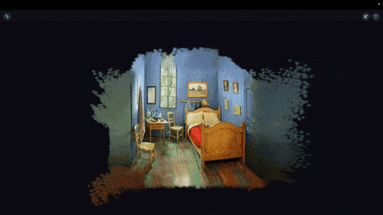

# Demo Hub

Personal demo hub for showcasing side projects.

## Live

**[artemv.tech](https://artemv.tech)**

### SHARP

Turn a single photo into an orbitable 3D Gaussian-Splatting scene in the
browser. Wraps Apple's [ml-sharp](https://github.com/apple/ml-sharp)
feed-forward predictor on a serverless Modal GPU; the platform side is
an async dispatch worker draining a dedicated RabbitMQ queue.



### Gaussian Spatting

Gaussian Splatting renderer running entirely in the browser. Custom C++
WebGPU engine, every-frame GPU radix sort + EWA splat projection in WGSL.
Same code path runs natively on macOS via Dawn → Metal.


Source: [renderer](https://github.com/art-vozniuk/renderer)

### Flux

Image-conditioned generative editing on FLUX.2 klein. Pick a cinematic
preset, upload a photo, get the same subject in the chosen style. The
inference itself runs on a serverless Modal GPU; the platform side is
an async dispatch worker draining a dedicated RabbitMQ queue.


### Transcriber

Upload a recording and get it back as a transcript split by speaker — who
said what, and when. Silero VAD trims the silence, Whisper transcribes
each speech chunk with word-level timestamps, and
[pyannote](https://github.com/pyannote/pyannote-audio) assigns a speaker
to every word. The transcription pipeline is a CUDA port of
[transcriber](https://github.com/art-vozniuk/transcriber) (an Apple-Silicon
tool that stays as it is); the platform side is the same async dispatch
worker the other Modal demos use.

### Face Swap

Upload a portrait and apply it to various style templates using a GAN-based image generation pipeline.


## Tech Stack

**Backend** — FastAPI, PostgreSQL, RabbitMQ, Redis, Nginx

**ML/AI** — PyTorch, ONNX Runtime, custom GAN pipeline, FLUX.2 klein on Modal, faster-whisper + pyannote on Modal

**Renderer** — C++, WebGPU, WGSL, Dawn / emdawnwebgpu, Emscripten, WebAssembly

**Frontend** — React, TypeScript, Vite, TailwindCSS

**Infra** — Docker, GitHub Actions, Supabase, Sentry, Modal

## Architecture

- **Core** — API gateway: auth, rate limiting, pipeline routing, ETA
- **Compute** — local ML inference workers (face_swap) consuming `pipelines.queue`
- **Dispatch** — async orchestration workers (generative_editing) consuming `pipelines.dispatch`, calling Modal
- **Modal** — serverless GPU apps (FLUX.2 klein, SHARP, TRELLIS.2, transcriber),
  all fronted by one HTTP gateway that routes on `payload["model"]`
- **Web** — React SPA
- **Renderer** — Emscripten WASM build served via Supabase Storage + GitHub Releases

The core service routes a queued pipeline to either `compute` or
`dispatch` based on `pipeline_name`, via a single mapping in
`services/core/app/pipelines/routing.py`. Workers from both pools
heartbeat into Redis through the shared `services/common/redis.heartbeat`
module; the core's `/pipelines/status` endpoint reads those heartbeats
plus a rolling pipeline-duration history to compute a unified
`eta_seconds` for any pending or running job.

## Project Structure

```
demo-hub/
├── services/
│   ├── common/          # Shared: auth, db, rabbitmq, redis (incl. heartbeat), s3
│   ├── core/            # API gateway + pipeline routing + ETA
│   ├── compute/         # Local ML workers (face_swap, face_recognition)
│   ├── dispatch/        # Async workers — call Modal for generative_editing
│   ├── modal/           # Modal apps: FLUX.2 klein, SHARP, TRELLIS.2, transcriber
│   ├── web/             # React frontend
│   └── external/        # renderer + face_swap submodules
├── nginx/               # Reverse proxy config
├── scripts/             # Build scripts (renderer, etc.)
├── docker-compose.yml
└── Makefile
```

## Running Locally

```bash
bash scripts/setup-local-env.sh             # one-time env scaffolding
docker compose -f docker-compose.local.yml up --build
```

For the Modal-backed demos additionally:

```bash
cd services/modal
./setup.sh                    # Modal CLI + secrets
python flux/preload.py        # populate a model volume (one-shot, per app)
python flux/deploy.py         # deploy the model app (no web endpoints)
python gateway/deploy.py      # deploy the gateway, prints submit/poll URLs
```

Dispatch reaches every model app through the one gateway, so only its URL pair
goes into `services/dispatch/.env.docker`:

```
MODAL_GATEWAY_SUBMIT_URL=https://...modal.run
MODAL_GATEWAY_POLL_URL=https://...modal.run
MODAL_PROXY_AUTH_TOKEN_ID=...
MODAL_PROXY_AUTH_TOKEN_SECRET=...
```

Full runbook, including which app needs which preload: [docs/DEPLOY.md](docs/DEPLOY.md).
